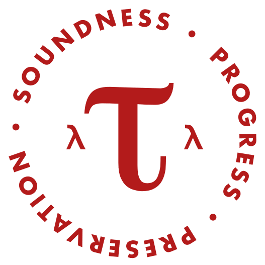

{{ course.days }}  
at {{ course.time }}  
in {{ course.room }}

### Instructor

[**Adrian Sampson**][adrian]  
<asampson@cs.cornell.edu>  
Office hours: Monday 2:30--3:30pm in Gates 411A

### Teaching Assistant

[**Andrew Hirsch**][andrew]  
<akhirsch@cs.cornell.edu>  
Office hours: Thursday 3--4pm in Rhodes 400

[adrian]: http://www.cs.cornell.edu/~asampson/
[andrew]: http://www.cs.cornell.edu/~akhirsch/
